# ARCHITECTURE — PIX Payment Platform

This document is the system design for PlatinumCoin's Pix platform. **Part I** presents the complete
target design (requirements, containers, service decomposition, data model, API). **Part II (§6)** is
the *implementation journey*: the same system delivered as **vertical slices — one flow per sprint** —
each drawn as a sequence diagram and annotated with the infrastructure it brings up. The brief poses
**seven key design questions**; they are answered inline and indexed in [§10](#10-index-answers-to-the-7-questions).

> **How to read this doc.** If you want the finished picture, read Part I. If you want to *build* it
> (or understand why it is built in this order), read Part II — it maps 1:1 to `PLAN.md`'s sprints and
> is deliberately incremental: nothing appears before the thing it depends on.

---

# Part I — The complete design

## 1. Requirements

### 1.1 Functional (from the brief)

| # | Requirement | Notes |
|---|---|---|
| F1 | Send Pix to any Pix key (CPF, e-mail, phone, random key), any bank | Core flow |
| F2 | Receive Pix from any bank, **real-time notification** | Chosen feature 1 |
| F3 | Balance (real-time) and paginated statement | Chosen feature 2, cache candidate |
| F4 | Pix key management: register, list, delete | Foundation for F1/F2 |
| F5 | Configurable daily limits | Embedded in the send flow |
| F6 | Real-time fraud detection | Chosen feature 3, ≤ 200ms budget |

Out of scope (per brief): scheduled Pix, dynamic QR (Pix Cobrança), automatic refunds, other payment rails, KYC/onboarding. **MFA is deferred** for this local build: the brief requires MFA above the daily limit; here transactions above the limit are simply **rejected with `422 LIMIT_EXCEEDED`**, and the seam where an MFA challenge would plug in is documented (ADR-0007).

### 1.2 Non-functional (from the brief)

| Category | Requirement | Target |
|---|---|---|
| Performance | Send latency (request → `202 Accepted`) | < 2s p99 |
| Performance | Balance read | < 300ms p99 |
| Performance | Throughput | ~58 TPS avg, 500+ TPS peak |
| Reliability | Availability | 99.99% (< 52 min downtime/yr) |
| Reliability | Ledger consistency | Strong (ACID), atomic debit+credit |
| Reliability | Durability | Zero loss of confirmed transactions |
| Reliability | Idempotency | Guaranteed under client retries |
| Reliability | Reconciliation of stuck transactions | < 5 min |
| Security | AuthN/AuthZ | JWT; debited account from token, never payload |
| Security | Fraud | Real-time, ≤ 200ms added to main flow |
| Security | Audit | Immutable log, retained ≥ 5 years (BACEN) |
| Security | Transport | TLS 1.2+ (documented; local runs plaintext) |
| Scalability | Horizontal scale, no manual intervention | Stateless services |
| Scalability | Data retention | 5 years online, then cold storage |
| Scalability | API versioning | No breaking changes for mobile clients |
| Observability | SLOs monitored, alert before users notice | Runbooks linked |

### 1.3 Regulatory context

Pix is operated by BACEN through the **SPI** (Sistema de Pagamentos Instantâneos). Participants integrate via API and must respect a **10-second settlement SLA** in business hours. Consequence for design: the user-facing request **cannot** block on settlement — the API is asynchronous (`202 Accepted`) and settlement is a background flow with its own reliability machinery (retries, DLQ, reconciliation).

### 1.4 Scale assumptions (back-of-envelope)

- 5M tx/day ÷ 86,400s ≈ **58 TPS average**; peaks 8–10× → **500+ TPS**.
- Each send produces ~2 ledger entries + 1 transaction item + 1 outbox item ≈ **4 writes/tx** → ~230 WPS average, ~2,000 WPS peak. Well within DynamoDB on-demand capacity; a single partition handles ~1,000 WPS, and our partition key (`accountId`) spreads load across millions of partitions. Hot-partition risk is concentrated on the internal **clearing account** — mitigated in §6.3.
- Reads are balance-dominated (every app open). Assuming 10 reads per transaction → ~580 RPS avg, ~5,000 RPS peak → **cache required** to meet 300ms p99 cheaply (Redis, §6.9).
- 5M tx/day × ~2KB (tx + entries) ≈ 10GB/day ≈ 3.6TB/yr hot data → 5-year online requirement pushes old statement pages to **S3 cold archive** (§6.10).
- All of this scales down to one PC: LocalStack + 8 JVM services + Redis fits comfortably in 32GB (each service capped at 512MB heap).

---

## 2. Container diagram (C4 level 2)

```mermaid
graph TB
    subgraph Client
        APP[Mobile App / curl]
    end

    subgraph Platform["PlatinumCoin Pix Platform — docker-compose"]
        AUTH[auth-service :8081<br/>issues JWT HS256]
        ACC[account-service :8082<br/>accounts, Pix keys, key lookup]
        FRAUD[fraud-service :8083<br/>rule-based score, p99 &lt; 150ms]
        PAY[payment-service :8084<br/>send/receive orchestration,<br/>idempotency, daily limits, status]
        LED[ledger-service :8085<br/>double-entry ledger, balance,<br/>statement source of truth]
        SET[settlement-service :8086<br/>SPI connector: settle, retry,<br/>DLQ, reconciliation, inbound]
        NOT[notification-service :8087<br/>SSE push to clients]
    end

    subgraph AWS["LocalStack :4566"]
        DDB[(DynamoDB<br/>accounts, pix_keys, ledger,<br/>transactions+outbox, idempotency)]
        SNS{{SNS topic pix-events}}
        SQ1[[SQS settlement-queue + DLQ]]
        SQ2[[SQS notification-queue + DLQ]]
        SQ3[[SQS audit-queue + DLQ]]
        S3[(S3 audit-log bucket<br/>statement-archive bucket)]
    end

    REDIS[(Redis :6379<br/>balance cache<br/>— stands in for ElastiCache)]
    BACEN[mock-bacen-spi :9090<br/>configurable latency ≤10s,<br/>failures, inbound Pix generator]

    APP --> AUTH
    APP --> ACC
    APP --> PAY
    APP -.SSE.- NOT

    PAY --> ACC
    PAY --> FRAUD
    PAY --> LED
    PAY --> REDIS
    LED --> DDB
    ACC --> DDB
    PAY --> DDB
    PAY -->|outbox polling publisher<br/>sparse GSI, 1s tick| SNS
    SNS --> SQ1
    SNS --> SQ2
    SNS --> SQ3
    SQ1 --> SET
    SQ2 --> NOT
    SQ3 --> SET
    SET <--> BACEN
    SET --> LED
    SET --> S3
```

**Note on Redis:** LocalStack does not emulate ElastiCache, so Redis runs as its own container in docker-compose. In production this maps 1:1 to ElastiCache for Redis.

> This is the **end state**. §6 shows how the platform arrives here one flow at a time — the same
> boxes light up gradually, sprint by sprint.

---

## 3. Service decomposition & responsibilities

| Service | Owns | Key responsibilities |
|---|---|---|
| **auth-service** | users (credentials) | Login → JWT (HS256 locally; RS256 + JWKS in prod). No MFA in this build (ADR-0007). |
| **account-service** | `accounts`, `pix_keys` tables | Account CRUD; Pix key register/list/delete with global uniqueness; key→account resolution (plays the role of BACEN's DICT for internal keys; delegates to mock-bacen for external keys). |
| **payment-service** | `transactions`, `idempotency` tables | The orchestrator. Validates JWT (debited account **from token**), enforces idempotency and daily limits, calls fraud (200ms budget), resolves the key, commands the ledger debit, writes transaction + outbox atomically, exposes status query, runs the outbox polling publisher (sparse GSI → SNS). |
| **ledger-service** | `ledger` table | **Single writer of money.** Double-entry postings via `TransactWriteItems`; conditional writes forbid negative balance; balance & statement reads; the only component allowed to mutate balances. |
| **settlement-service** | settlement lifecycle | Consumes `settlement-queue`, calls BACEN SPI, retries with backoff, DLQ, confirms/reverses via ledger + payment status; **reconciliation job** (<5 min); receives inbound Pix from mock-bacen; writes immutable audit records to S3. |
| **fraud-service** | fraud rules/state | Synchronous `/score` (rule-based: velocity, amount, new payee, odd hours) engineered for p99 < 150ms, leaving margin inside the 200ms budget. |
| **notification-service** | client connections | Consumes `notification-queue`, pushes events over **SSE** to connected clients (SSE chosen over WebSocket: one-directional push, simpler, HTTP-native). |
| **mock-bacen-spi** | nothing (stub) | Simulates SPI: `POST /spi/settlements` with configurable latency (0–10s) and failure/timeout rates; `GET /spi/settlements/{endToEndId}` for reconciliation; `POST /simulate/inbound-pix` to generate incoming Pix. |

**Why this decomposition (summary of ADR-0006):** boundaries follow domain seams with different consistency, latency and scaling profiles — the ledger needs strict serializable-ish writes; fraud needs low-latency reads and can be scaled/replaced independently; settlement is IO-bound on a slow external system; notifications hold long-lived connections. Splitting them keeps failure domains small (fraud down ≠ payments down, thanks to fail-open) and matches team ownership at a real fintech. The cost — network hops, distributed debugging, eventual consistency between services — is accepted and mitigated with the outbox pattern and correlation ids.

---

## 4. Data model (summary — full detail in [docs/data-model.md](docs/data-model.md))

| Table | PK / SK | Purpose | GSIs |
|---|---|---|---|
| `accounts` | `USER#<userId>` / `ACCOUNT#<accountId>` | Account metadata, daily limit config | GSI1: `accountId` lookup |
| `pix_keys` | `KEY#<keyValue>` / `META` | Global key uniqueness via conditional `PutItem` | GSI1: `ACCOUNT#<accountId>` → list keys |
| `ledger` | `ACCOUNT#<accountId>` / `BALANCE` and `ENTRY#<ts>#<txId>` | Balance item + immutable double-entry postings | GSI1: `TX#<txId>` → both legs of a posting |
| `transactions` | `TX#<txId>` / `META` and `OUTBOX#<eventId>` | Transaction state machine + **outbox items in the same table** (so one `TransactWriteItems` covers both) | GSI1: `E2E#<endToEndId>`; GSI2: `STATUS#<status>` + `updatedAt` (reconciliation scan); GSI3 (sparse): unpublished outbox |
| `idempotency` | `IDEM#<accountId>#<key>` / `META` | Request hash + stored response, TTL 24h | — |

**Transaction state machine:**

```
RECEIVED → FRAUD_CHECKED → DEBITED → SENT_TO_SPI → SETTLED
                │               │           │
                └ REJECTED      │           ├→ FAILED → REVERSED (compensating credit)
                  (fraud/limit) │           └→ (timeout) … reconciliation resolves
                                └ REJECTED (insufficient funds)
```

---

## 5. API design (summary — contract in [docs/api/openapi.yaml](docs/api/openapi.yaml))

> **Answers Question 6** (endpoints + idempotency).

| Endpoint | Purpose | Notes |
|---|---|---|
| `POST /v1/auth/login` | Issue JWT | auth-service |
| `POST /v1/payments/pix` | Send Pix | **`Idempotency-Key` header required**; returns **`202 Accepted`** + `transactionId`; body has `pixKey`, `amount`, `description` — **never** the source account (comes from JWT `sub`/`accountId` claim) |
| `GET /v1/payments/{transactionId}` | Status query | Poll-friendly; also pushed via SSE |
| `GET /v1/accounts/me/balance` | Balance | Redis cache-aside, < 300ms p99 |
| `GET /v1/accounts/me/statement?cursor=&limit=` | Paginated statement | Cursor = DynamoDB `LastEvaluatedKey` (opaque, base64) |
| `POST /v1/pix-keys` / `GET /v1/pix-keys` / `DELETE /v1/pix-keys/{keyValue}` | Key management | Uniqueness enforced by conditional write |
| `GET /v1/notifications/stream` | SSE stream | notification-service |

**Idempotency mechanism (Question 6):**

1. Client generates a UUID `Idempotency-Key` per business operation and reuses it on retry.
2. payment-service does a **conditional `PutItem`** on `idempotency` (`attribute_not_exists(pk)`) storing the SHA-256 of the canonical request body.
   - Put succeeds → first time → process.
   - `ConditionalCheckFailed` → key exists: same request hash → **replay the stored response** (same `202` + same `transactionId`); different hash → **`409 Conflict`** (key reuse with different payload).
3. Scope: `accountId + key`; TTL 24h.
4. Defense in depth: the ledger posting itself is also idempotent (conditional write keyed by `txId`), so even an internal retry after step 2 cannot double-debit. The `endToEndId` (Pix standard `E<ISPB><timestamp><random>`) makes the SPI call idempotent on BACEN's side.

**Why `202` and not `200`:** the money has not settled (SPI can take 10s). `202` communicates "accepted for processing"; the resource to poll is returned in `Location` and the body. This is the honest contract for an async operation.

---

# Part II — The implementation journey (flow by flow)

## 6. Incremental delivery — sprints & flows

The platform is built as **vertical slices**: each sprint ships one complete, testable, documented
**flow** and brings up **only the infrastructure that flow needs**. This section draws each flow and
states, per flow, which infra comes up. It maps 1:1 to `PLAN.md`.

### 6.0 Why vertical (not big-bang), and the order

A horizontal plan ("scaffold all 8 services → stand up all infra → add each layer everywhere") keeps
the system un-runnable until very late and couples every change to every service. A **vertical** plan
keeps a runnable, demoable artifact at the end of *every* sprint, and makes the dependency order
explicit: you cannot move money before the **ledger** exists, and asynchronous **external** settlement
(with its SNS/SQS/BACEN machinery) is strictly harder than a **synchronous internal** transfer — so
internal Pix comes first and earns the walking skeleton that external Pix later thickens.

**Sprint dependency graph** (an edge = "needs the capability of"):

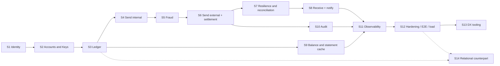

**Cumulative infrastructure** — what is running by the end of each sprint (each row *adds* to the
previous):

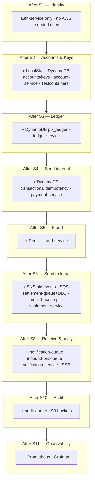

Sprints 7, 9, 12, 13 add behavior/tests/tooling but no new infra container.

---

### 6.1 Flow — Identity (login → JWT)   · Sprint 1 · infra: none (AWS-free)

The simplest capability, and the one nothing depends on: authenticate a seeded user and mint a JWT.
Signing is **HS256** with a shared secret locally (RS256 + JWKS in prod, ADR-0007). The token carries
`sub` (userId), `accountId`, `jti`, `iat`, `exp` (15 min). The **validation filter lives in common-lib**,
so every later service enforces auth by depending on the library — zero per-service boilerplate.

```mermaid
sequenceDiagram
    autonumber
    participant App
    participant AUTH as auth-service
    App->>AUTH: POST /v1/auth/login {username, password}
    AUTH->>AUTH: verify against seeded users
    AUTH-->>App: 200 {accessToken (JWT HS256), expiresIn: 900}
    Note over App,AUTH: later calls carry Authorization: Bearer <JWT>;<br/>common-lib JwtAuthFilter validates on every protected route
```

**Why first / what it earns:** a stable auth edge means every subsequent flow can be exercised
end-to-end (you always have a token). No AWS is needed — users are seeded in config and tests run on
MockMvc, so Sprint 1 has the fastest possible feedback loop.

---

### 6.2 Flow — Accounts & Pix keys (register / resolve a key)   · Sprint 2 · infra: **LocalStack DynamoDB** + Testcontainers

The first flow that touches AWS. LocalStack comes up with **DynamoDB only** (`pix_accounts`, `pix_keys`),
and the Testcontainers harness lands in common-lib so integration tests never depend on the compose stack.
**Global key uniqueness** is the critical invariant, enforced by a **conditional `PutItem`**
(`attribute_not_exists(pk)`) — the DynamoDB equivalent of a `UNIQUE` constraint, with no read-then-write
race. Internal key resolution (the hot lookup in every send) is served here; delegation to BACEN's DICT
for *external* keys arrives in Sprint 6, when mock-bacen exists.

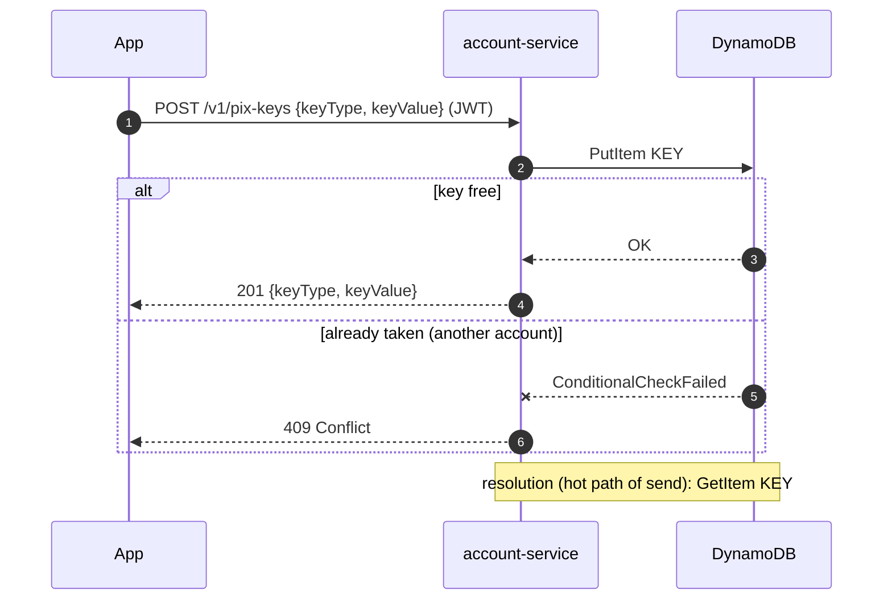

---

### 6.3 Flow — Ledger posting (never debit without credit)   · Sprint 3 · infra: DynamoDB `pix_ledger`

**The heart of the system** and the direct answer to *Question 2*. A posting is **one**
`TransactWriteItems` — DynamoDB transactions are ACID across up to 100 items, so either all four writes
commit or none do. No intermediate state can exist where a debit lands without its credit.

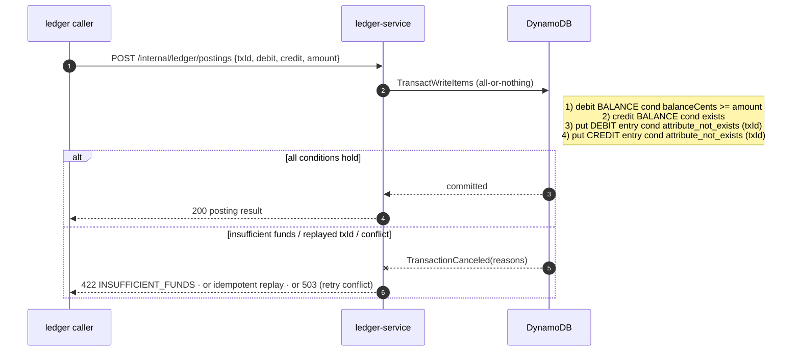

- **Internal transfer (PlatinumCoin → PlatinumCoin):** debit payer / credit payee directly. One atomic transaction, done — this is exactly what Sprint 4 uses.
- **External transfer (Sprint 6):** you cannot span a distributed transaction across two banks, so the credit leg goes to an **internal SPI clearing account** (`debit payer / credit ACCOUNT#SPI_CLEARING`). On SPI confirmation the money has left the bank (a `CLEARING_RELEASE` entry); on definitive failure a **compensating posting** (`debit clearing / credit payer`) returns it. At every instant `Σ balances` is invariant: **money moves, it is never created or destroyed.**

Guards enforced *inside* the transaction (never as a prior read):
- `balance >= :amount` on the debtor → **no negative balance**, checked atomically with the debit.
- `attribute_not_exists` on the entry keyed by `txId` → **the same transaction can never post twice**.
- `version` attribute (optimistic locking) on balances; DynamoDB serializes conflicting items via `TransactionConflict`, retried with jitter.

Property-style concurrency tests (Sprint 3, step 15 — hand-written) fire N parallel debits exceeding the balance and assert exactly ⌊balance/amount⌋ succeed and `Σ entries == Δ balances`.

**Clearing-account hot partition (forward reference to Sprint 14).** All external sends credit
`ACCOUNT#SPI_CLEARING` → at 500 TPS that single item nears DynamoDB's ~1,000 WPS per-partition ceiling.
Mitigation: **write sharding** — N clearing sub-accounts (`SPI_CLEARING#00..#15`) picked by hash of
`txId`; the logical balance is the sum. Implemented and **proven under the Black Friday k6 profile in
step 52** (before/after in `docs/sharding-findings.md`); the shard used at debit time is stored on the
transaction item so a reversal always compensates the same shard. **Design note for the incremental
build:** because the ledger posting is keyed by explicit `debitAccount`/`creditAccount` from Sprint 3,
introducing shards later changes only *which* clearing id the caller passes — the posting contract,
invariants and Sprint 4 code are untouched. That isolation is deliberate.

---

### 6.4 Flow — Send Pix, internal & synchronous   · Sprint 4 · infra: DynamoDB `pix_transactions` + `pix_idempotency`

The first flow that **moves a user's money end-to-end**, and it does so **synchronously**: an internal
Pix (alice → bob's internal key) needs no settlement, no queue, no BACEN. This is the walking skeleton
that Sprint 6 later thickens into the asynchronous external path. It exercises idempotency, daily limits
and the atomic ledger debit from Sprint 3.

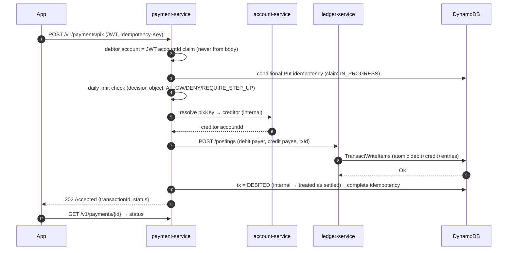

**Question 6 in action:** the required `Idempotency-Key` is claimed with a conditional put (lock+memo in
one write); a retry with the same key+body replays the stored `202` (same `transactionId`); a different
body under the same key → `409`. Even an internal retry cannot double-debit, because the ledger posting
is itself idempotent by `txId` (Sprint 3).

**Question 1 (source account):** the debited account is derived **exclusively** from the JWT `accountId`
claim — the request body has no source-account field at all (the safest way to enforce "never from the
payload" is to make it inexpressible; ADR-0007).

---

### 6.5 Flow — Fraud scoring in the path   · Sprint 5 · infra: Redis

Fraud scoring is inserted **between limit-check and ledger debit** with a **hard 200ms client timeout**
(fraud-service targets p99 < 150ms). Redis comes up here to hold velocity counters. Answers *Question 5*.

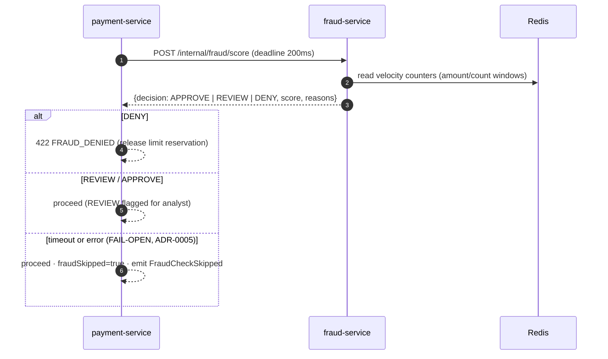

**The trade-off (ADR-0005):** fail-**open** means a fraud-service outage lets unscored payments through
(bounded by daily limits + async re-scoring); fail-**closed** would let any fraud-service blip reject
100% of legitimate payments. For a core money-movement product, availability wins *at this layer*; the
documented production evolution is a hybrid (fail-closed above a value threshold).

---

### 6.6 Flow — Send Pix, external & asynchronous   · Sprint 6 · infra: **SNS + SQS(+DLQ) + mock-bacen-spi**

Now the walking skeleton grows its asynchronous half. External sends credit the **clearing account**
(§6.3), persist `tx=DEBITED` **together with an outbox event in one `TransactWriteItems`**, and answer
`202` in well under 2s — the user never waits on BACEN. A polling publisher drains the outbox to SNS; the
settlement-service consumes from SQS and talks to the SPI (up to 10s). This is where the messaging infra
first comes up. Answers *Questions 1 & 4*.

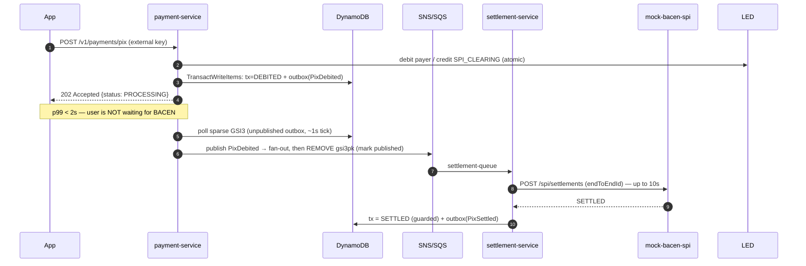

**Question 4 (10s SPI latency — does the user wait?):** No. The synchronous part ends at `202` with
status `PROCESSING`; the 10s window is absorbed by the SQS-buffered settlement flow. The app shows
"processing" and gets the final state via SSE (Sprint 8) or polling `GET /v1/payments/{id}`.

**Why outbox + polling (ADR-0004):** writing the DB and publishing to SNS are two systems → the
dual-write problem. The outbox item lives in the **same table/partition** as the transaction, so both
commit in one transaction; the publisher publishes-then-marks on a **sparse GSI** (at-least-once), and
consumers dedupe by `eventId`. DynamoDB Streams would be lower-latency but the most complex consumer in
the project, buying nothing against a 10s SPI SLA — documented as the production evolution.

---

### 6.7 Flow — Resilience: retries, DLQ & reconciliation (< 5 min)   · Sprint 7 · infra: none new

Settlement becomes failure-proof, and "eventual" becomes **eventually *bounded***.

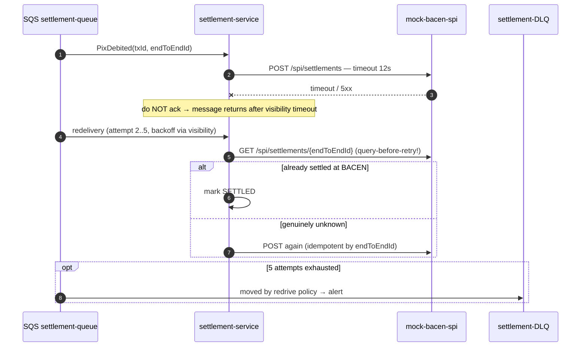

The subtle rule: **after a timeout you must query before retrying blind** — a timeout is not a failure,
BACEN may have settled. Separately, a scheduled **reconciliation job** (every 60s) scans `transactions`
GSI2 for `status IN (DEBITED, SENT_TO_SPI)` older than 2 min → queries the SPI → finalizes (SETTLED) or
**compensates** (`debit clearing / credit payer`, status `REVERSED`, notify user). Age > 5 min raises an
SLO-breach alert. Compensation is a *new* posting, never an update/delete — the ledger stays append-only.

---

### 6.8 Flow — Receive Pix + real-time notification   · Sprint 8 · infra: **notification-queue + inbound-pix-queue + SSE**

Inbound Pix is idempotent by `endToEndId` (BACEN may redeliver); the clearing account is the debit leg,
mirroring outbound. The notification-service holds one SSE connection per user and routes events to the
affected user's emitter. Answers *Feature F2*.

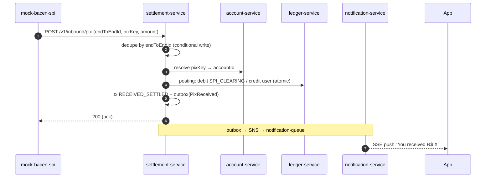

---

### 6.9 Flow — Balance & statement with cache   · Sprint 9 · infra: none new (Redis cache-aside)

Balance reads are the highest-volume operation and must be < 300ms p99. **Cache-aside** on Redis:
read → hit? return : read ledger `BALANCE` → populate (TTL 5s) → return. Every posting **invalidates**
the affected keys (best-effort, post-commit); the short TTL is the backstop. **Correctness rule:** the
cache serves *display* reads only — any money-moving decision (`balance >= amount`) happens inside the
DynamoDB conditional write, so the cache can never cause an overdraft.

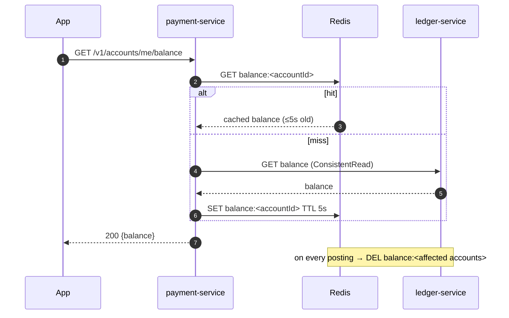

Statement pagination reuses the ledger's timestamp-prefixed sort keys (`ENTRY#ts#txId`,
`ScanIndexForward=false`); the API cursor is the base64 of `LastEvaluatedKey`.

---

### 6.10 Flow — Immutable audit trail   · Sprint 10 · infra: **audit-queue + S3**

An `audit-queue` subscribed to *all* events feeds an `AuditWriter` that appends JSON lines to S3,
partitioned `yyyy/MM/dd/HH/<service>-<uuid>.jsonl`. A `StatementArchiver` copies ledger entries older
than the hot window to a cold-archive bucket. Immutability posture: **versioning + Object Lock
(compliance mode) + 5-year retention** (LocalStack accepts the config; the guarantee is real in AWS).

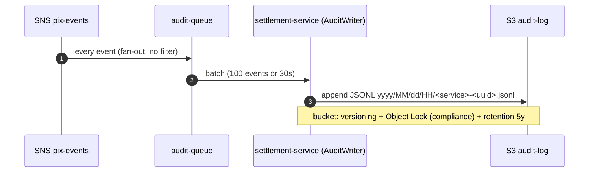

---

### 6.11 Flow — Observability   · Sprint 11 · infra: **Prometheus + Grafana**

Three layers — **logs** (what happened to *this* request, via `correlationId`), **metrics** (how the
*system* behaves, Micrometer → Prometheus), **dashboards** (who needs to see it, Grafana as code). Two
dashboards ship: **Technical** (p50/p99 vs SLO lines, throughput, errors, queue/DLQ depth, cache hit,
JVM) and **Business funnel** (payments per stage RECEIVED→…→SETTLED with REJECTED/REVERSED branches,
conversion %, fraud mix, reconciliation actions, R$ settled). **Silence alerts** detect the *absence* of
expected events (how async systems fail): e.g. "debits flowing but no settlement in 120s". A
`scripts/trace.sh <correlationId>` reconstructs one transaction's full path across all services from the
structured logs — proving the logging contract from CLAUDE.md. Details in §7.7.

---

## 7. Cross-cutting concerns

### 7.1 Idempotency
Covered in §5. Three layers: API (`Idempotency-Key` + stored response), ledger (conditional entry by `txId`), SPI (`endToEndId`).

### 7.2 Consistency
- **Within the ledger:** strong — `TransactWriteItems` + condition expressions (§6.3).
- **Across services:** eventual, made *reliable* by the transactional outbox (ADR-0004): state change and event are committed atomically in DynamoDB; a polling publisher (publish-then-mark on a sparse GSI) delivers at-least-once to SNS; consumers dedupe by event id. No dual-write window where the DB commits but the event is lost.
- **Balance cache:** cache-aside with invalidation on every posting + short TTL (5s) as a backstop; the ledger is always the source of truth, and any money-moving decision reads the ledger, never the cache.

### 7.3 Performance
- Send path budget (p99 < 2s): JWT validation ~1ms, idempotency put ~10ms, limit check ~10ms, fraud ≤200ms, key resolution ~20ms, ledger transaction ~30ms, tx+outbox write ~20ms → ~300ms typical, huge margin.
- Balance < 300ms p99: Redis hit ~1ms; miss → DynamoDB `GetItem` ~10ms + populate.
- 500 TPS peak: stateless services scale horizontally (in prod, auto-scaling; locally, `docker compose up --scale`); DynamoDB on-demand absorbs bursts; SQS buffers the slow SPI so peaks never back-pressure the user-facing path.

### 7.4 Availability — 99.99% and the 30s ledger outage (Question 7)

**How to reach four nines (production posture, documented; locally single-instance):**
- Every service stateless → ≥3 replicas across 3 AZs behind load balancers; deploys are rolling with health checks.
- DynamoDB, SQS, SNS, S3 are multi-AZ managed services with SLAs at or above 99.99%; the design has **no self-managed stateful component** on the critical path (Redis is a cache — losing it degrades latency, not correctness).
- Failure isolation: fraud fail-open (§7.5); settlement fully buffered by SQS (BACEN down ⇒ queue grows, users unaffected at accept-time); notification loss ⇒ degraded UX only, state still queryable.
- Error budget: 99.99% ⇒ 4.3 min/month — deploys must be zero-downtime, and the reconciliation job plus DLQ alarms keep MTTR low.

**Ledger down for 30 seconds:** the ledger is the one hard dependency of the *send* path — by design: **rejecting a payment is always safer than guessing about money.**
- `POST /payments/pix` during the outage: the ledger call fails fast (timeout 1s, circuit breaker opens after N failures) → **`503 Service Unavailable` + `Retry-After: 5`**. Nothing was debited (the ledger write is the *first* money mutation), the idempotency record stores no successful response, so the client's retry with the same key processes cleanly. No inconsistency, no double charge — availability of *accepting new sends* degrades, correctness does not.
- In-flight settlements/receives: consumers can't finalize → messages stay on SQS (that's what the queue is for), reconciliation catches anything odd after recovery.
- Balance reads: served from Redis cache (possibly ≤5s stale) → reads survive the outage.
- 30s of send unavailability consumes ~12% of a monthly four-nines budget — acceptable if rare; the multi-AZ posture above is what makes it rare.

### 7.5 Fraud under 200ms (Question 5)

Synchronous scoring with a **hard client-side timeout of 200ms** (fraud-service itself targets p99 < 150ms):
- Rule-based engine reading pre-computed features from fast stores (velocity counters in Redis, account age, payee novelty) — no heavy model inference in-path. In production, the same seam holds a low-latency model; heavy models run *asynchronously* on the event stream and feed back block-lists that the synchronous check reads cheaply.
- Decisions: `APPROVE` / `REVIEW` (approve + flag) / `DENY`.
- **Timeout/failure ⇒ fail-open** (ADR-0005): the payment proceeds, flagged `FRAUD_SKIPPED`, and a `FraudCheckSkipped` event triggers asynchronous scoring; hits feed an alert/review path. Trade-off: fail-closed would let a fraud-service blip take down 100% of payments to stop a fraction of a percent of fraud — for a payments product, availability wins *at this layer*, with the risk bounded because limits still apply, and a production hybrid (fail-closed above a value threshold) is the documented evolution.

### 7.6 Security & audit
- JWT on every request; **debited account only from token claims** — payload never names the source account (also enforced by API shape: the field does not exist).
- Daily limits checked server-side before any money moves; above-limit ⇒ `422` (MFA seam documented, ADR-0007).
- Immutable audit: every state transition emits an audit event → `audit-queue` → settlement-service writes JSON lines to S3, bucket documented with **Object Lock (compliance mode) + versioning** for the 5-year BACEN retention (LocalStack accepts the configuration; the guarantee is real in AWS). Statement pages older than the online window are archived to S3 too.
- TLS 1.2+ everywhere in production (LB termination + in-mesh); local compose runs plaintext and says so.

### 7.7 Observability
- **Logs**: SLF4J + Logback JSON encoder in every service. Each request gets a `correlationId` at the edge (generated if absent), propagated via header and MDC to every downstream call and every consumer (events carry it in the envelope) — so **the complete path of any transaction is reconstructable across all services** by filtering one id. Stage-named INFO events (`payment.accepted`, `fraud.scored`, `ledger.posted`, `settlement.settled`, …) make the funnel greppable; payloads only at DEBUG and masked.
- **Metrics**: Micrometer → Prometheus (scrapes every service's `/actuator/prometheus`).
- **Dashboards (Grafana, provisioned as code)**: (1) *Technical* — latency p50/p99 per endpoint vs SLO lines (2s send, 300ms balance), throughput, error rates, queue depths + DLQ, cache hit rate, JVM basics; (2) *Business funnel* — payments by stage over time (RECEIVED → FRAUD_CHECKED → DEBITED → SENT_TO_SPI → SETTLED, with REJECTED/REVERSED branches), conversion between stages, fraud decision mix, reconciliation actions, money volume settled. The funnel view is the one a product owner reads — observability that answers business questions, not only "is the CPU ok".
- **Silence alerts** for async flows: a watchdog metric per stage (e.g., "no settlement completed in 120s while debits are flowing") — detecting the *absence* of expected events, which is how async systems usually fail. DLQ depth > 0 alerts immediately. Reconciliation-age > 5 min alerts (SLO guard).
- OpenTelemetry tracing is optional locally; correlation ids make manual trace-following possible without it.
- **Load validation**: three k6 profiles (`load/k6/`) exercise the stated SLOs — low (quiet hours), standard (~58 TPS, the daily average), Black Friday (ramp to 500+ TPS peak) — with thresholds failing the run if p99 budgets or error rates are violated.

### 7.8 API versioning
URI versioning (`/v1/...`); additive-only changes within a version; new fields optional; deprecation policy documented per endpoint. Breaking change ⇒ `/v2` served side by side (mobile clients lag).

---

## 8. Ledger storage choice (Question 3)

**Choice: DynamoDB with transactions — deliberately, with the trade-off stated.**

A payments ledger *naturally* pulls toward a relational database: native ACID across arbitrary rows, strong consistency by default, SQL for reconciliation/reporting, mature constraint enforcement (`CHECK balance >= 0`), decades of financial-industry precedent. If the requirement set stopped at "5M tx/day, strong consistency", **PostgreSQL would be a perfectly correct — arguably the default — answer**, and ADR-0001 says so explicitly.

DynamoDB wins here on the *other* NFRs:
- **99.99% availability + zero manual scaling:** multi-AZ, managed, on-demand capacity absorbs the 8–10× Black Friday peak with no failover scripting or connection-pool tuning. A single-writer Postgres needs careful HA engineering to promise four nines.
- **Transactions are enough for this access pattern:** the ledger needs exactly "atomically update 2 balances + insert 2 entries with conditions" — a fixed, small, key-addressable write set. `TransactWriteItems` covers it with serializable semantics. We do not need cross-entity joins in the hot path.
- **Predictable single-digit-ms latency at any scale**, feeding the <2s and <300ms budgets.
- **5-year retention:** designed-in partition scaling + TTL + easy export to S3.

What we give up, and how we compensate:
- No ad-hoc SQL → reporting/reconciliation via GSIs designed up front and S3 exports (Athena in prod).
- 100-item transaction cap, no multi-region strong consistency → fine for this write set; documented as a constraint.
- Constraints live in application-issued condition expressions, not schema → concentrated in **one service (ledger-service)** and defended by invariant tests.

**When to choose which:** relational when the domain needs flexible multi-row transactions, rich queries, and a team fluent in operating HA Postgres at your scale; DynamoDB when access patterns are known and key-shaped, availability/elasticity targets are extreme, and you can encode invariants as conditional writes. This project intentionally exercises the second path — and, since Sprint 14, **also builds the first**: `labs/ledger-pg` (ADR-0009) implements the same ledger port on PostgreSQL with both locking strategies, runs the same invariant suite, and records `EXPLAIN`/benchmark findings, so the rule of thumb is backed by first-hand numbers. (Full analysis: ADR-0001.)

For the **transaction history** (statement): the ledger entries themselves, keyed `ACCOUNT#id / ENTRY#timestamp#txId`, give natural reverse-chronological pagination — same table, no extra store; cold pages archive to S3.

---

## 9. Trade-offs & alternatives considered

| Decision | Alternative | Why we chose as we did |
|---|---|---|
| DynamoDB ledger | PostgreSQL | ADR-0001; §8 |
| Async settlement, `202` | Sync wait for SPI | 10s SLA makes sync UX and thread-pool math untenable; async + push notification is the industry pattern |
| Outbox drained by polling publisher | Write-then-publish (dual write); Streams/CDC | Dual-write loses events or states. Streams would add the project's most complex consumer (shards, checkpoints) to gain subsecond latency that a 10s SPI SLA makes irrelevant — polling every 1–2s on a sparse GSI is simpler and sufficient; Streams documented as the production evolution (ADR-0004) |
| Fraud sync + fail-open | Fail-closed; fully async fraud | Fail-closed couples availability to fraud-service; fully async can't block a payment at all. Sync-with-budget + fail-open balances both (ADR-0005) |
| SNS+SQS | Kafka | Fits the LocalStack constraint; fan-out + DLQ + per-queue scaling with zero broker ops; Kafka would win for replay/stream processing at larger scope |
| Microservices | Modular monolith | A monolith would be *simpler* and is a legitimate 3-month-deadline answer; chosen decomposition demonstrates the target-state design and independent failure domains (ADR-0006) |
| Vertical (flow-per-sprint) delivery | Horizontal (layer-by-layer) | Keeps a runnable, demoable artifact at the end of every sprint; makes the dependency order explicit; infra rises only when a flow needs it (§6.0) |
| SSE notifications | WebSocket | One-way push only; SSE is simpler, auto-reconnecting, plain HTTP |
| Redis cache-aside | DAX; no cache | DAX not in LocalStack; no-cache makes 300ms p99 costlier at read volume |

---

## 10. Index — answers to the 7 questions

| # | Question | Where |
|---|---|---|
| 1 | Components + send flow end-to-end | §2, §3, §6.4, §6.6 |
| 2 | Never debit without credit — consistency mechanism | §6.3 (+ docs/data-model.md) |
| 3 | Database for ledger & history | §8, ADR-0001 |
| 4 | 10s SPI latency — does the user wait? | §6.6, §6.7 |
| 5 | Fraud layer under 200ms | §6.5, §7.5, ADR-0005 |
| 6 | REST endpoints + idempotency | §5, §6.4, docs/api/openapi.yaml, ADR-0002 |
| 7 | 99.99% availability; ledger down 30s | §7.4 |
