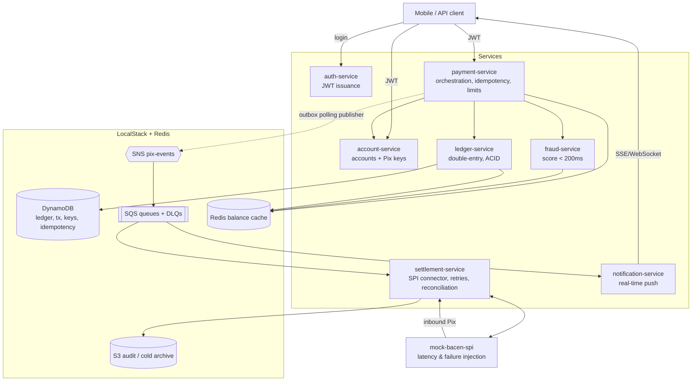

# PIX Payment Platform — PlatinumCoin

[](https://github.com/filiperibolli/platinumcoin-pix/actions/workflows/ci.yml)
[](LICENSE)
[](https://openjdk.org/projects/jdk/21/)
[](https://spring.io/projects/spring-boot)

A **Pix instant-payment platform** designed and built from scratch as a system-design + implementation exercise: send and receive Pix, ACID double-entry ledger, idempotent APIs, asynchronous settlement against a mock BACEN SPI, real-time fraud scoring under a 200ms budget, real-time notifications, cached balance/statement, and an immutable audit trail.

Everything runs **100% locally** on a single machine via `docker-compose`, using **LocalStack** to emulate AWS (DynamoDB, SQS, SNS, S3) and a **Redis** container standing in for ElastiCache.

## Objectives of this project

This is a **personal project with two explicit goals**, in this order:

1. **Learning by building**: hands-on practice with AWS services via LocalStack (DynamoDB single-table design and transactions, SQS/SNS messaging, S3), distributed-systems patterns (idempotency, transactional outbox, sagas with compensation, reconciliation, caching, latency budgets), Docker Compose orchestration and observability — every implementation step documents *why* the pattern exists, not just *how*.
2. **Portfolio**: a realistic, end-to-end payments platform demonstrating architecture decision-making (ADRs with honest trade-offs), spec-driven development with AI assistance, TDD discipline, load testing against explicit SLOs, and production-minded documentation.

## The problem

PlatinumCoin (a fintech) needs its Pix infrastructure built from a blank page:

- Users send Pix to any Pix key (CPF, e-mail, phone, random key) at any bank.
- Users receive Pix from any bank, with **real-time notification**.
- Balance and paginated statement, balance reads **< 300ms p99**.
- Pix key management (register / list / delete).
- Daily limits; account to debit always derived **from the JWT, never from the payload**.
- **Ledger with strong consistency**: debit and credit are atomic — no double-spend, no negative balance, zero transaction loss.
- **Idempotency**: client retries never duplicate charges.
- BACEN SPI settles in **up to 10 seconds** → user gets `202 Accepted` in < 2s p99; settlement is asynchronous.
- Stuck transactions reconciled in **< 5 minutes**.
- Fraud scoring adds **at most 200ms** to the main flow.
- Reference scale: 50M users, 5M tx/day, ~58 TPS average, 500+ TPS peak, 99.99% availability.

Full requirements analysis and the answers to the 7 key design questions: [`ARCHITECTURE.md`](ARCHITECTURE.md).

## Architecture at a glance



## Roadmap — 14 sprints (vertical, flow by flow)

This project is built as **vertical slices, not horizontal layers**: each sprint ships **one complete,
testable, documented flow** and brings up **only the infrastructure that flow needs** — no big-bang.
Ordering is dependency-correct (ledger before the first money-moving Pix; internal synchronous Pix
before external asynchronous settlement). Full breakdown in [`PLAN.md`](PLAN.md); each flow is drawn as
a Mermaid sequence diagram in [`ARCHITECTURE.md`](ARCHITECTURE.md) §6.

| Sprint | Flow delivered | Infra que sobe (novo) |
|---|---|---|
| **S1** | Identity — login → JWT | none (AWS-free; seeded users) |
| **S2** | Accounts & Pix keys — register / resolve a key | LocalStack **DynamoDB** + Testcontainers |
| **S3** | Ledger — atomic double-entry, balance, invariants | DynamoDB `pix_ledger` |
| **S4** | Send Pix **internal** (synchronous, moves real money) | DynamoDB `pix_transactions` + `pix_idempotency` |
| **S5** | Fraud scoring in the path (≤200ms, fail-open) | **Redis** |
| **S6** | Send Pix **external** (async settlement via SPI) | **SNS + SQS(+DLQ)** + mock-bacen-spi |
| **S7** | Resilience — retries, DLQ, reconciliation (<5min) | none new (schedulers) |
| **S8** | Receive Pix + real-time SSE notification | notification-queue, SSE |
| **S9** | Balance & statement with cache (<300ms p99) | none new (Redis cache-aside) |
| **S10** | Immutable audit trail + cold archive | audit-queue, **S3** |
| **S11** | Observability (technical + business funnel) | **Prometheus + Grafana** |
| **S12** | Hardening, E2E journey & k6 load tests | k6 |
| **S13** | DX tooling — Postman collection + HTML API explorer | none |
| **S14** | Relational counterpart lab + sharding + cold export (Block Q) | PostgreSQL (Testcontainers, lab) |

## Stack

| Layer | Choice |
|---|---|
| Language / runtime | Java 21 LTS |
| Framework | Spring Boot 3.x |
| Build | Maven multi-module |
| Ledger & data | DynamoDB (`TransactWriteItems` + conditional writes) via LocalStack |
| Messaging | SNS fan-out + SQS queues + DLQs; transactional outbox with polling publisher |
| Cache | Redis container (represents ElastiCache — LocalStack does not emulate it) |
| Object storage | S3 (immutable audit log, cold statement archive) |
| Orchestration | docker-compose only (no Kubernetes) |
| Tests | JUnit 5, Testcontainers (LocalStack, Redis) |
| Observability | SLF4J structured JSON logs with correlation id (full request path traceable), Actuator + Micrometer → Prometheus, Grafana dashboards (technical + business funnel), silence/reconciliation alerts |

## What this project demonstrates

- **Financial-grade consistency on DynamoDB**: double-entry ledger with atomic debit/credit via `TransactWriteItems`, conditional writes preventing negative balance and double-spend — plus an explicit, honest trade-off analysis vs. a relational database (ADR-0001).
- **Idempotency done properly**: client-supplied `Idempotency-Key`, request-hash comparison, stored response replay, `409` on key reuse with a different payload.
- **Asynchronous settlement**: `202 Accepted` UX decoupled from a slow (≤10s) external rail, with retries, DLQs and a < 5-minute reconciliation loop for stuck transactions.
- **Reliable event publishing**: transactional outbox (state + event committed atomically) drained by a polling publisher — no dual-write problem; Streams/CDC documented as the production evolution (ADR-0004).
- **Latency-budgeted fraud scoring**: 200ms hard budget with fail-open fallback and post-hoc review (trade-off in ADR-0005).
- **Microservice decomposition by domain**, spec-driven implementation, TDD, and AI-assisted development discipline (`CLAUDE.md`).
- **Observability that answers business questions**: Grafana dashboards including a payment funnel (received → fraud-checked → debited → settled) on top of Prometheus metrics, plus SLF4J structured logs that let you follow one transaction across every service by `correlationId`.
- **Load testing against the stated SLOs**: three k6 profiles (low, standard ~58 TPS, Black Friday 500+ TPS) asserting the p99 targets.
- **API DX**: a unified Postman collection and a self-contained HTML API explorer with pre-filled valid requests.
- **The relational counterpart, measured**: a `labs/ledger-pg` module implements the same ledger port on PostgreSQL with **both** locking strategies (pessimistic `SELECT FOR UPDATE` and optimistic versioning), passes the same invariant storm suite, and documents `EXPLAIN` plans, index write-cost and a contention benchmark vs. the DynamoDB path (ADR-0009, Block Q).
- **Async cold-statement retrieval**: historical statement export as `202 Accepted` + polling status URL + downloadable artifact — the standard fintech pattern for slow reads (step 53).
- **Messaging portability**: an explicit [SNS/SQS ↔ Kafka appendix](docs/messaging-kafka-appendix.md) mapping every concept used here to its Kafka equivalent.

## Repository layout

```
.
├── README.md                  ← you are here
├── ARCHITECTURE.md            ← full system design + answers to the 7 questions
├── CLAUDE.md                  ← context & rules for Claude Code
├── PLAN.md                    ← implementation roadmap (index of steps)
├── CHANGELOG.md               ← Keep a Changelog; one entry per completed step
├── docs/
│   ├── adr/                   ← Architecture Decision Records (0001–0009)
│   ├── api/openapi.yaml       ← REST contract
│   ├── data-model.md          ← DynamoDB tables, keys, GSIs, ledger invariants
│   ├── messaging-kafka-appendix.md ← SNS/SQS ↔ Kafka concept mapping
│   ├── observability.md       ← metric catalog + alert rules (created in step 44)
│   ├── local-dev.md           ← local environment runbook
│   └── steps/                 ← one fine-grained implementation step per file
├── services/                  ← (common-lib in step 01; each service added in its sprint) Maven modules
├── labs/ledger-pg/            ← (steps 50-51) non-deployable lab: relational ledger counterpart
├── infra/                     ← (created in step 06) docker-compose, LocalStack init
│   └── observability/         ← (step 44) Prometheus config + Grafana provisioning/dashboards
├── load/k6/                   ← (step 47) k6 load-test scripts: low, standard, black-friday
├── tools/postman/             ← (step 48) unified Postman collection + environment
├── tools/api-explorer/        ← (step 49) single-file HTML API explorer with valid sample calls
└── pom.xml                    ← (created in step 01) parent POM
```

## Running locally (once implemented)

Prerequisites: Docker + Docker Compose, Java 21, Maven 3.9+. Sized for a 32GB RAM / 6-core desktop.

```bash
# 1. Build all services
mvn clean package -DskipTests

# 2. Start infrastructure + services
docker compose -f infra/docker-compose.yml up -d

# 3. LocalStack init scripts create tables/queues/topics/buckets automatically
#    (infra/localstack/init/*.sh run on container ready)

# 4. Smoke test
curl -s http://localhost:8081/actuator/health   # auth-service
curl -s http://localhost:8084/actuator/health   # payment-service

# 5. Send your first Pix (full walkthrough in docs/local-dev.md)
TOKEN=$(curl -s -X POST localhost:8081/v1/auth/login -H 'Content-Type: application/json' \
  -d '{"username":"alice","password":"alice"}' | jq -r .accessToken)

curl -s -X POST localhost:8084/v1/payments/pix \
  -H "Authorization: Bearer $TOKEN" \
  -H "Idempotency-Key: $(uuidgen)" \
  -H 'Content-Type: application/json' \
  -d '{"pixKey":"bob@platinum.com","amount":"125.50","description":"lunch"}'
# → 202 Accepted { "transactionId": "...", "status": "PROCESSING" }
```

Detailed runbook, ports, env vars and per-flow test commands: [`docs/local-dev.md`](docs/local-dev.md).

## How this repo is meant to be worked on

1. Open [`PLAN.md`](PLAN.md), pick the next unchecked step.
2. Read its spec in `docs/steps/step-XX.md` — it defines objective, tasks, tests (TDD) and acceptance criteria.
3. Implement **one step at a time** (rules in [`CLAUDE.md`](CLAUDE.md)), tests first.
4. When tests pass and acceptance criteria are met: update `CHANGELOG.md`, check the box in `PLAN.md`, commit (Conventional Commits).

## Security

Security policy and responsible disclosure: [`SECURITY.md`](SECURITY.md).
STRIDE threat model over the money-moving flows: [`docs/threat-model.md`](docs/threat-model.md).

## License

Released under the [MIT License](LICENSE) — © 2026 Filipe Ribolli.
