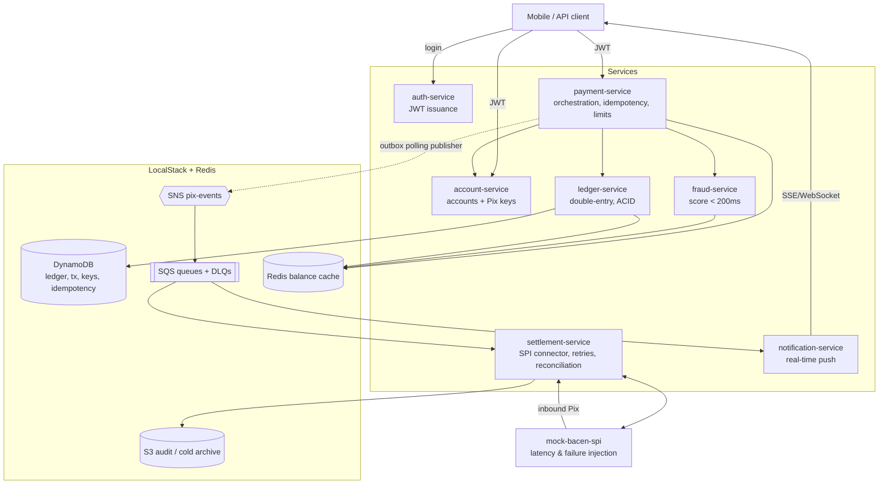

# PIX Payment Platform — PlatinumCoin

[](https://github.com/filiperibolli/platinumcoin-pix/actions/workflows/ci.yml)
[](LICENSE)
[](https://openjdk.org/projects/jdk/21/)
[](https://spring.io/projects/spring-boot)

A **Pix instant-payment platform** designed and built from scratch as a system-design + implementation exercise: send and receive Pix, ACID double-entry ledger, idempotent APIs, asynchronous settlement against a mock BACEN SPI, real-time fraud scoring under a 200ms budget, real-time notifications, cached balance/statement, and an immutable audit trail.

Everything runs **100% locally** on a single machine via `docker-compose`, using **LocalStack** to emulate AWS (DynamoDB, SQS, SNS, S3) and a **Redis** container standing in for ElastiCache.

## How I would build Pix

This is my answer to a concrete architecture question: *if I owned Pix at a fintech and started from a blank page, how would I build it?* It's the design I would bring to a staff-level review — a realistic instant-payments platform where every non-trivial decision is written down with its trade-off instead of being hand-waved, and where the code exists to prove the design survives contact with reality (a slow rail, a duplicated retry, a stuck transaction).

The stance behind it:

- **Correctness of money is non-negotiable; everything else is a budget.** The ledger carries the strongest invariants — atomic double-entry, no negative balance, no double-spend, all enforced *inside* the write, not in application code. Fraud, settlement, notifications and caches are then free to degrade, retry or lag, as long as the money stays exact.
- **Design for the failure mode, not the happy path.** A ≤10s BACEN rail, a fraud engine that times out, a client that retries, a transaction that gets stuck — each has an explicit, tested answer: async settlement behind `202 Accepted`, fail-open fraud under a hard 200ms budget, client idempotency keys, and a <5-min reconciliation loop.
- **Make the reasoning auditable, not just the code runnable.** ADRs capture the honest trade-offs (DynamoDB vs. relational, outbox vs. CDC, microservices vs. monolith), and observability is built to answer *business* questions — a payment funnel a product owner can read — not only "is the CPU ok". A reviewer should be able to interrogate *why*, not just watch it work.
- **Size the design to the SLOs, and no larger.** 50M users, 5M tx/day, ~58 TPS average, 500+ TPS peak, 99.99% target — the architecture is sized to those numbers. No Kubernetes, no speculative generality; every moving part earns its place against a requirement.

It runs 100% locally (LocalStack + Redis via `docker-compose`) so the whole design is reproducible end-to-end on a single machine — the platform is the artifact, and it's meant to be run, read and argued with.

## The problem

PlatinumCoin (a fintech) needs its Pix infrastructure built from a blank page:

- Users send Pix to any Pix key (CPF, e-mail, phone, random key) at any bank.
- Users receive Pix from any bank, with **real-time notification**.
- Balance and paginated statement, balance reads **< 300ms p99**.
- Pix key management (register / list / delete).
- Daily limits; account to debit always derived **from the JWT, never from the payload**.
- **Ledger with strong consistency**: debit and credit are atomic — no double-spend, no negative balance, zero transaction loss.
- **Idempotency**: client retries never duplicate charges.
- BACEN SPI settles in **up to 10 seconds** → user gets `202 Accepted` in < 2s p99; settlement is asynchronous.
- Stuck transactions reconciled in **< 5 minutes**.
- Fraud scoring adds **at most 200ms** to the main flow.
- Reference scale: 50M users, 5M tx/day, ~58 TPS average, 500+ TPS peak, 99.99% availability.

Full requirements analysis and the answers to the 7 key design questions: [`ARCHITECTURE.md`](ARCHITECTURE.md).

## Architecture at a glance



## Why one domain (and what splitting it would cost)

Eight deployables, but **one bounded context** — a deliberate choice, and the honest first reason is the one people skip past: **this is a single-machine, single-team, learning-and-portfolio artifact.** The whole platform runs under one `docker-compose`, is owned by one person in one repo, and exists to be read and argued with end to end. At that scale, carving it into separate *business* domains would be organizational machinery with no organization to serve — coordination cost with nothing to coordinate.

But "it's local" is not the only reason it *should* stay one domain even at real scale-for-one-team:

- **It models a single business capability.** "Move a Pix from A to B, correctly and fast" is one capability with one ubiquitous language (accounts, keys, transactions, ledger entries, settlement). The services are a decomposition **inside** that domain along *technical* seams — where consistency, latency and scaling profiles differ (the ledger needs serializable-ish writes; fraud needs single-digit-ms reads; settlement is IO-bound on a slow external rail; notifications hold long-lived connections) — not a split into separate businesses (ADR-0006).
- **Conway's law.** One team maps cleanly to one domain. Multiple domains presuppose multiple owning teams with independent roadmaps; inventing those boundaries before the teams exist manufactures coordination cost, not autonomy.
- **Avoid premature abstraction.** A shared risk platform, a standalone rail-integration domain, an identity domain — each is the *right* target the day a second consumer or a second team appears. Building them now is abstraction ahead of a second caller: the contract-and-versioning tax paid before anything collects it.
- **Keep the failure story readable.** One deploy pipeline, one `correlationId` that reconstructs a whole transaction, one place to reason about what breaks. The blast-radius isolation a domain boundary would buy is already provided *within* the domain — fraud is fail-open (ADR-0005), settlement is fully buffered by SQS (BACEN down ⇒ queue grows, users unaffected at accept-time).

**What splitting into multiple domains would look like** — the day the org (not the code) demands it:

| Domain (would-be) | Services it absorbs | Core responsibility | Cross-domain communication | What changes / the trade-off |
|---|---|---|---|---|
| **Payments** (core) | payment-service, ledger-service | Orchestrate the send/receive saga; own the money and its invariants | Publishes `PixDebited`/`PixSettled`; calls Risk and Rail via versioned contracts | Stays the anchor, but in-process calls (fraud, key resolution) become network hops with contracts to version |
| **Risk** | fraud-service (+ shared models) | Scoring across *all* products (Pix, cards, onboarding), block-lists, case management | Sync `score` API under an SLA contract; consumes the event stream for async re-scoring | Reusable by other products — but adds a network + contract + versioning boundary **on the 200ms money path**, the exact cost the one-domain design avoids today |
| **Rail integration** | settlement-service, mock-bacen-spi | Own every external rail (SPI today; TED/cards/boletos later), retries, reconciliation, rail auth | Consumes settlement events; calls back via `PixSettled`/`PixReversed` | Rails evolve independently of payments; the outbox→queue→worker seam already exists, so this is the **cheapest** split — but reconciliation now spans two domains' state |
| **Identity & directory** | auth-service, account-service | Users, credentials/MFA, accounts, Pix keys, DICT resolution | Issues JWT; serves key→account lookups as an API | Independently hardened and audited — but key resolution (hot path of every send) becomes a cross-domain call instead of a local one |
| **Customer comms** | notification-service | All outbound customer messaging (push, SSE, email, SMS) | Consumes the event fan-out; no callbacks | Already an event consumer only, so it's the **lowest-risk** split — mostly a team-ownership move |

**How the data would split — and why that's the expensive part.** A real domain split is a **data** split first: each domain **privately owns its store**, no other domain reads its tables directly, and data crosses a boundary only through an API call or an event (*data on the inside vs. data on the outside*). Mapping today's stores onto the would-be domains:

| Domain (would-be) | Owns its data store | Data it holds | How other domains touch it |
|---|---|---|---|
| **Payments** (core) | DynamoDB `pix_ledger`, `pix_transactions` (+ outbox, daily-limit counters, exports), `pix_idempotency`; Redis balance cache | Balances, double-entry entries, tx state machine, idempotency keys | Others read balance/status via the Payments **API**; state changes are emitted as **events** — never a direct table read |
| **Risk** | Redis velocity counters + its own scoring/block-list store | Per-account velocity windows, block-lists, case state | Payments calls the `score` **API**; Risk consumes the **event stream** for async re-scoring — it never reads the ledger |
| **Rail integration** | Its own settlement store; S3 audit bucket | Settlement lifecycle, reconciliation cursors, rail audit trail | Consumes settlement **events**, calls back via `PixSettled`/`PixReversed` **events** |
| **Identity & directory** | DynamoDB `pix_accounts`, `pix_keys` | Users, credentials, Pix keys, the DICT map | Serves key→account resolution and account reads as an **API**; issues JWTs |
| **Customer comms** | Its own delivery/read-model store | Notification log, delivery status, SSE registry | **Event** consumer only; nobody reads its store |

The expensive part is not drawing that table — it's that **two things the current design does in a single atomic write can no longer happen across a boundary**, both documented as deliberate exceptions in ADR-0006:

1. **The outbox stops being free.** Today settlement-service writes `pix_transactions` *directly* so a status change **and** its outbox event commit in one `TransactWriteItems` (ADR-0004) — no dual-write window. Move settlement into a **Rail** domain and that table belongs to **Payments**: the atomic state-change-plus-event can't span two domains' stores, so you reintroduce exactly the dual-write problem the outbox exists to kill — now solved with a cross-domain **saga** and inter-domain reconciliation, not just reconciliation against BACEN.
2. **Shared dedup fragments.** The one tiny `pix_processed_events` table (ADR-0006 exception #2) becomes one consumer-dedup store **per domain** — more moving parts, same guarantee.

So the split is cheap on the *service* seams (they already talk via ports/APIs/events) and expensive on the *data* seams (atomicity that lives inside one DynamoDB transaction today turns into eventual consistency plus reconciliation between domains). That asymmetry is the whole reason the boundary is drawn where it is.

**The trade-off I'm accepting by staying one domain:**

| Keeping it one domain buys | The cost / risk | How it's mitigated |
|---|---|---|
| One ubiquitous language; no cross-domain contract & versioning tax | Can't be independently owned/scaled by separate orgs | Right call for one team at this scale (Conway); revisit when a second team appears |
| Cheap refactoring across service seams (still one repo) | Risk of drifting into a **distributed monolith** | `common-lib` kept deliberately thin; **no shared tables** except two documented exceptions (ADR-0006); APIs/events only |
| `correlationId` reconstructs a whole transaction across all services trivially | Capabilities (fraud, rail) can't yet be reused by other products | Each sits behind a port/API/event — any row above can **graduate to its own domain** later without rewriting the payment orchestrator |
| One deploy pipeline, one failure story to reason about | 8 JVMs of operational surface for one team | 512MB heap caps, one-command `docker-compose`, fail-open so fraud down ≠ payments down |

The seams are drawn so each row of the split table **can** become its own domain later — because every cross-service call already goes through a port, an API or an event, never a shared in-memory object. Splitting earlier would pay an organizational tax nobody is collecting yet.

## Roadmap — 14 sprints (vertical, flow by flow)

This project is built as **vertical slices, not horizontal layers**: each sprint ships **one complete,
testable, documented flow** and brings up **only the infrastructure that flow needs** — no big-bang.
Ordering is dependency-correct (ledger before the first money-moving Pix; internal synchronous Pix
before external asynchronous settlement). Full breakdown in [`PLAN.md`](PLAN.md); each flow is drawn as
a Mermaid sequence diagram in [`ARCHITECTURE.md`](ARCHITECTURE.md) §6.

| Sprint | Flow delivered | Infra que sobe (novo) |
|---|---|---|
| **S1** | Identity — login → JWT | none (AWS-free; seeded users) |
| **S2** | Accounts & Pix keys — register / resolve a key | LocalStack **DynamoDB** + Testcontainers |
| **S3** | Ledger — atomic double-entry, balance, invariants | DynamoDB `pix_ledger` |
| **S4** | Send Pix **internal** (synchronous, moves real money) | DynamoDB `pix_transactions` + `pix_idempotency` |
| **S5** | Fraud scoring in the path (≤200ms, fail-open) | **Redis** |
| **S6** | Send Pix **external** (async settlement via SPI) | **SNS + SQS(+DLQ)** + mock-bacen-spi |
| **S7** | Resilience — retries, DLQ, reconciliation (<5min) | none new (schedulers) |
| **S8** | Receive Pix + real-time SSE notification | notification-queue, SSE |
| **S9** | Balance & statement with cache (<300ms p99) | none new (Redis cache-aside) |
| **S10** | Immutable audit trail + cold archive | audit-queue, **S3** |
| **S11** | Observability (technical + business funnel) | **Prometheus + Grafana** |
| **S12** | Hardening, E2E journey & k6 load tests | k6 |
| **S13** | DX tooling — Postman collection + HTML API explorer | none |
| **S14** | Relational counterpart lab + sharding + cold export (Block Q) | PostgreSQL (Testcontainers, lab) |

## Stack

| Layer | Choice |
|---|---|
| Language / runtime | Java 21 LTS |
| Framework | Spring Boot 3.x |
| Build | Maven multi-module |
| Ledger & data | DynamoDB (`TransactWriteItems` + conditional writes) via LocalStack |
| Messaging | SNS fan-out + SQS queues + DLQs; transactional outbox with polling publisher |
| Cache | Redis container (represents ElastiCache — LocalStack does not emulate it) |
| Object storage | S3 (immutable audit log, cold statement archive) |
| Orchestration | docker-compose only (no Kubernetes) |
| Tests | JUnit 5, Testcontainers (LocalStack, Redis) |
| Observability | SLF4J structured JSON logs with correlation id (full request path traceable), Actuator + Micrometer → Prometheus, Grafana dashboards (technical + business funnel), silence/reconciliation alerts |

## What this project demonstrates

- **Financial-grade consistency on DynamoDB**: double-entry ledger with atomic debit/credit via `TransactWriteItems`, conditional writes preventing negative balance and double-spend — plus an explicit, honest trade-off analysis vs. a relational database (ADR-0001).
- **Idempotency done properly**: client-supplied `Idempotency-Key`, request-hash comparison, stored response replay, `409` on key reuse with a different payload. *Where does the key come from?* The **frontend mints it** — a random UUIDv4 (`crypto.randomUUID()` in a browser, `UUID.randomUUID()` on Android, `UUID().uuidString` on iOS) generated **once, the moment the user taps "confirm", and bound to that payment intent — not to the HTTP request**. Every automatic retry of that same payment (network timeout, a lost `2xx`, the app being relaunched) sends the *same* key, so the debit happens at most once; a genuinely new payment mints a new key. The client persists the key alongside the pending-payment draft, so even a killed-and-reopened app resumes under the same key rather than risking a double charge. The server never trusts the client for correctness — it treats the key only as a dedup token (scoped per `accountId`), and the ledger's `txId` conditional write is the second, independent line of defense (ADR-0002).
- **Asynchronous settlement**: `202 Accepted` UX decoupled from a slow (≤10s) external rail, with retries, DLQs and a < 5-minute reconciliation loop for stuck transactions.
- **Reliable event publishing**: transactional outbox (state + event committed atomically) drained by a polling publisher — no dual-write problem; Streams/CDC documented as the production evolution (ADR-0004).
- **Latency-budgeted fraud scoring**: 200ms hard budget with fail-open fallback and post-hoc review (trade-off in ADR-0005).
- **Microservice decomposition by domain**, spec-driven implementation, TDD, and AI-assisted development discipline (`CLAUDE.md`).
- **Observability that answers business questions**: Grafana dashboards including a payment funnel (received → fraud-checked → debited → settled) on top of Prometheus metrics, plus SLF4J structured logs that let you follow one transaction across every service by `correlationId`.
- **Load testing against the stated SLOs**: three k6 profiles (low, standard ~58 TPS, Black Friday 500+ TPS) asserting the p99 targets.
- **API DX**: a unified Postman collection and a self-contained HTML API explorer with pre-filled valid requests.
- **The relational counterpart, measured**: a `labs/ledger-pg` module implements the same ledger port on PostgreSQL with **both** locking strategies (pessimistic `SELECT FOR UPDATE` and optimistic versioning), passes the same invariant storm suite, and documents `EXPLAIN` plans, index write-cost and a contention benchmark vs. the DynamoDB path (ADR-0009, Block Q).
- **Async cold-statement retrieval**: historical statement export as `202 Accepted` + polling status URL + downloadable artifact — the standard fintech pattern for slow reads (step 53).
- **Messaging portability**: an explicit [SNS/SQS ↔ Kafka appendix](docs/messaging-kafka-appendix.md) mapping every concept used here to its Kafka equivalent.

## OKRs & KPIs

Framed as if this were a real platform: **OKRs** are the outcomes the architecture commits to, and **KPIs** are the steady-state signals you'd watch on the wall afterwards. The KRs are the SLOs from [The problem](#the-problem) made measurable.

This set is deliberately **trimmed to the outcomes an operator can verify from live telemetry** — Prometheus metrics, structured logs, and k6 thresholds. Each retained KR/KPI names *where and how* it is observed. Guarantees that are proven by tests rather than metrics (append-only history, concurrency invariants) live in the invariant suite; postures that are not reproducible on one machine (99.99% availability) live in the ADRs — both are intentionally kept out of the KR set so every number below is one you can actually watch turn green.

**Objective 1 — Never lose or corrupt money.** *(the non-negotiable one)*
- **KR1.1** 0 negative-balance / 0 double-spend / 0 duplicate-debit — money is conserved end to end.
  *Observed:* the invariant-storm suite ([step 15](docs/steps/step-15.md)) proves it under concurrency; the **conservation-of-money assertion** in the E2E journey ([step 46](docs/steps/step-46.md)) closes `Σ balances == seeded supply` after a chaotic run; in runtime, the funnel's **REJECTED** branch and the idempotency-replay counter ([step 44](docs/steps/step-44.md)) show overdrafts/duplicates rejected = 0.

**Objective 2 — Keep the user-facing path fast.**
- **KR2.1** Send-Pix acknowledgement **p99 < 2s**.
  *Observed:* k6 threshold `http_req_duration{endpoint:send} p(99)<2000` fails the run on breach ([step 47](docs/steps/step-47.md)); the *Technical* dashboard's p99-vs-SLO panel ([step 44](docs/steps/step-44.md)).
- **KR2.2** Balance read **p99 < 300ms**.
  *Observed:* k6 threshold `{endpoint:balance} p(99)<300` ([step 47](docs/steps/step-47.md)); *Technical* dashboard latency + cache-hit panels ([step 44](docs/steps/step-44.md)).

**Objective 3 — Stay reliable behind a slow, flaky external rail.**
- **KR3.1** Stuck transactions detected and reconciled in **< 5 min**.
  *Observed:* the `reconciliation.oldest.seconds` metric with its `>300` SLO alert ([step 35](docs/steps/step-35.md)); the E2E failure drill confirms resolution under 5 min ([step 46](docs/steps/step-46.md)).
- **KR3.2** DLQ depth returns to 0 after a simulated SPI outage — retries with backoff drain the backlog, nothing is lost.
  *Observed:* the DLQ-depth gauge with its `>0` alert in the AlertEvaluator/dashboard ([step 44](docs/steps/step-44.md)); drain proven under the failure drill ([step 46](docs/steps/step-46.md)).

**Objective 4 — Make it operable and auditable.**
- **KR4.1** A single `correlationId` reconstructs 100% of a transaction's path across all services.
  *Observed:* `scripts/trace.sh <correlationId>` plus the path-audit test over the per-stage INFO events ([step 44](docs/steps/step-44.md)); exercised end to end in the E2E journey ([step 46](docs/steps/step-46.md)).

**KPIs (steady-state health):**

| KPI | What it tells you | Healthy signal | Where it's observed |
|---|---|---|---|
| Funnel conversion per stage (RECEIVED→…→SETTLED, REJECTED/REVERSED branches) | *Where* payments drop off (fraud vs. settlement) | No unexpected cliff between stages | Grafana Business-Funnel dashboard — `pix.payments.stage{stage,outcome}` ([step 44](docs/steps/step-44.md)) |
| Send p99 / Balance p99 | User-facing latency vs. budget | < 2s / < 300ms | Grafana Technical dashboard + k6 thresholds ([steps 44](docs/steps/step-44.md), [47](docs/steps/step-47.md)) |
| Fraud decision mix + fail-open rate | Risk posture & how often the 200ms budget is blown | Stable mix; fail-open rare | Grafana — `pix.fraud.decision{decision}` + `FraudCheckSkipped` rate ([step 44](docs/steps/step-44.md)) |
| DLQ depth / retry rate / SPI error rate | Reliability of the external-rail integration | DLQ trends to 0; retries bounded | Grafana Technical + AlertEvaluator DLQ-depth alert ([steps 44](docs/steps/step-44.md), [35](docs/steps/step-35.md)) |

## Repository layout

```
.
├── README.md                  ← you are here
├── ARCHITECTURE.md            ← full system design + answers to the 7 questions
├── CLAUDE.md                  ← context & rules for Claude Code
├── PLAN.md                    ← implementation roadmap (index of steps)
├── CHANGELOG.md               ← Keep a Changelog; one entry per completed step
├── docs/
│   ├── brief.md               ← the exercise brief + the 7 design questions, verbatim
│   ├── adr/                   ← Architecture Decision Records (0001–0009)
│   ├── api/openapi.yaml       ← REST contract
│   ├── data-model.md          ← DynamoDB tables, keys, GSIs, ledger invariants
│   ├── messaging-kafka-appendix.md ← SNS/SQS ↔ Kafka concept mapping
│   ├── observability.md       ← metric catalog + alert rules (created in step 44)
│   ├── local-dev.md           ← local environment runbook
│   └── steps/                 ← one fine-grained implementation step per file
├── services/                  ← (common-lib in step 01; each service added in its sprint) Maven modules
├── labs/ledger-pg/            ← (steps 50-51) non-deployable lab: relational ledger counterpart
├── infra/                     ← (created in step 06) docker-compose, LocalStack init
│   └── observability/         ← (step 44) Prometheus config + Grafana provisioning/dashboards
├── load/k6/                   ← (step 47) k6 load-test scripts: low, standard, black-friday
├── tools/postman/             ← (step 48) unified Postman collection + environment
├── tools/api-explorer/        ← (step 49) single-file HTML API explorer with valid sample calls
└── pom.xml                    ← (created in step 01) parent POM
```

## Running locally (once implemented)

Prerequisites: Docker + Docker Compose, Java 21, Maven 3.9+. Sized for a 32GB RAM / 6-core desktop.

```bash
# 1. Build all services
mvn clean package -DskipTests

# 2. Start infrastructure + services
docker compose -f infra/docker-compose.yml up -d

# 3. LocalStack init scripts create tables/queues/topics/buckets automatically
#    (infra/localstack/init/*.sh run on container ready)

# 4. Smoke test
curl -s http://localhost:8081/actuator/health   # auth-service
curl -s http://localhost:8084/actuator/health   # payment-service

# 5. Send your first Pix (full walkthrough in docs/local-dev.md)
TOKEN=$(curl -s -X POST localhost:8081/v1/auth/login -H 'Content-Type: application/json' \
  -d '{"username":"alice","password":"alice"}' | jq -r .accessToken)

curl -s -X POST localhost:8084/v1/payments/pix \
  -H "Authorization: Bearer $TOKEN" \
  -H "Idempotency-Key: $(uuidgen)" \
  -H 'Content-Type: application/json' \
  -d '{"pixKey":"bob@platinum.com","amount":"125.50","description":"lunch"}'
# → 202 Accepted { "transactionId": "...", "status": "PROCESSING" }
```

Detailed runbook, ports, env vars and per-flow test commands: [`docs/local-dev.md`](docs/local-dev.md).

## How this repo is meant to be worked on

1. Open [`PLAN.md`](PLAN.md), pick the next unchecked step.
2. Read its spec in `docs/steps/step-XX.md` — it defines objective, tasks, tests (TDD) and acceptance criteria.
3. Implement **one step at a time** (rules in [`CLAUDE.md`](CLAUDE.md)), tests first.
4. When tests pass and acceptance criteria are met: update `CHANGELOG.md`, check the box in `PLAN.md`, commit (Conventional Commits).

### Starter prompt for a new step session

Paste this at the start of a fresh Claude Code conversation to run one step under the mandatory workflow. Leave `STEP` blank to take the first unchecked step, or name one (e.g. `STEP = 14`):

```text
You are working on the PlatinumCoin Pix platform. Follow CLAUDE.md exactly — it overrides any default behavior.

STEP = <blank = first unchecked step in PLAN.md>

Before writing any code:
1. Read CLAUDE.md in full: conventions, the six domain safety rules, the mandatory per-step workflow,
   hand-written zones (✍️), and the per-step AI-metrics rule.
2. Open PLAN.md and take that step only (or the first unchecked one if STEP is blank).
3. Read its docs/steps/step-XX.md completely — the step file IS the spec (spec-driven). Also read
   anything it references: the relevant ARCHITECTURE.md § and ADRs, and the step's ADR learning
   companion if one exists (docs/steps/step-XX-adrNNNN.md).
4. Confirm the step's prerequisites are checked in PLAN.md. If not, STOP and tell me.

Then, BEFORE coding, reply with a short plan and WAIT for my "go":
- Restate the step's objective in one or two sentences.
- List the exact files you intend to add or change.
- Flag whether any part is a ✍️ hand-written zone — if so, you review only, you do NOT generate that code.
- Write down your honest time estimate now (the `est` metric).

After I say "go":
5. TDD: write the step's tests first (red) → minimum code to pass (green) → refactor. Every money
   invariant gets an explicit test. Money is integer cents (long) — never float/double.
6. Implement ONLY what the step's tasks describe. If something adjacent is broken, note it — don't fix it
   silently. If reality diverges from the docs (API/schema/ADR), STOP and update the doc in the SAME change.
7. Verify with the step's "How to verify locally" commands and `mvn verify` for touched modules.
   All tests green, nothing skipped.
8. Check the step's Definition of Done items one by one — quote each and check it off.
9. Update CHANGELOG.md with the step's entry, followed by the metrics line:
   `  AI: est <Xh> / actual <Yh> / ~<Z>% generated / <N> issues caught in human review`
   Then check the step's box in PLAN.md.
10. Commit with Conventional Commits (e.g. `feat(ledger): atomic double-entry posting (step 14)`),
    one step = one commit (or a small clean series). Only commit/push if I asked; branch first if on main.
11. STOP — do not start the next step. End with one open-ended conceptual question that tests my grasp of a
    trade-off or edge case this step introduced.

Never bend: idempotency on money-moving POSTs; debit account from the JWT, never the payload; never a
negative balance (condition inside the write); debit+credit atomic; ledger append-only (compensate, never
update/delete). Explain your reasoning as you go — trade-offs, edge cases, deviations.
```

## Security

Security policy and responsible disclosure: [`SECURITY.md`](SECURITY.md).
STRIDE threat model over the money-moving flows: [`docs/threat-model.md`](docs/threat-model.md).

## License

Released under the [MIT License](LICENSE) — © 2026 Filipe Ribolli.
