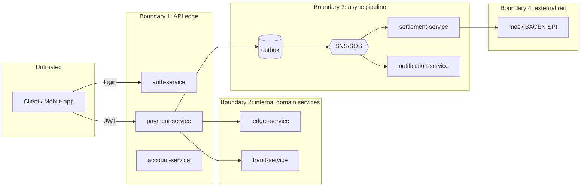

# Threat Model — PlatinumCoin Pix Platform

**Status:** Living document · **Owner:** @filiperibolli · **Method:** STRIDE per trust boundary

This document takes an attacker's-eye view of the platform. It complements
[`SECURITY.md`](../SECURITY.md) (policy) and the [ADRs](adr/) (decisions): here we ask
*"what can go wrong, who could make it go wrong, and what stops them?"*

> **Scope reminder.** This is a local learning system: emulated AWS (LocalStack), a
> mock BACEN SPI, no real funds, no production PII, no deployed surface. Network-layer
> threats (TLS, DDoS, cloud IAM) are therefore mostly *documented as production
> concerns* rather than mitigated locally. The threats we take seriously are the ones
> intrinsic to the **domain logic** — because those bugs would be real in production
> too, and the whole point of the project is to get them right.

---

## 1. Assets — what an attacker wants

Ranked by blast radius, most critical first.

| # | Asset | Why it matters | Worst outcome |
|---|-------|----------------|---------------|
| A1 | **Ledger integrity** (balances + entries) | It *is* the money | Funds created/destroyed; negative balance; double-spend |
| A2 | **Authorization context** (JWT → `accountId`) | Decides *whose* money moves | Debit someone else's account |
| A3 | **Idempotency guarantees** | Retries must not duplicate charges | Double debit on replay |
| A4 | **Funds availability** (the send path staying up) | Availability is a trust/security property for a payments app | Legitimate payments blocked |
| A5 | **PII / Pix keys** (CPF, email, phone) | Regulated personal data (LGPD) | Key enumeration, data leak |
| A6 | **Signing secret** (JWT HS256 key) | Forges any identity | Total auth bypass |
| A7 | **Audit trail** (S3 immutable log) | Non-repudiation, reconciliation | Tampered/rewritten history |
| A8 | **Event pipeline** (outbox → SNS/SQS) | Drives settlement & notifications | Lost, duplicated, or forged settlement |

---

## 2. Trust boundaries

- **B1 (edge)** — the only boundary an external attacker reaches directly. Everything
  crossing it is *untrusted input*; the debited account is decided **here**, from the
  token, not from the body.
- **B2 (domain)** — ledger and fraud. The ledger trusts only validated commands; it
  enforces money invariants at the database level regardless of caller correctness.
- **B3 (async)** — at-least-once delivery. Duplicates and reordering are *expected*,
  not exceptional, so they are threats mitigated by design (dedup, guarded transitions).
- **B4 (external)** — the SPI is slow and unreliable by construction; threats here are
  about idempotency and reconciliation, not confidentiality.

---

## 3. STRIDE analysis

Each row: a concrete threat → the control that stops it → residual risk. Controls that
already exist in the design are marked ✅; documented-but-not-implemented-locally gaps
are marked ⚠️.

### S — Spoofing (identity)

| Threat | Control | Residual |
|--------|---------|----------|
| Attacker calls `POST /payments/pix` as another user | JWT required; `accountId` taken from signed `sub`/`accountId` claim, never the body (ADR-0007) ✅ | Depends on secret secrecy (A6) |
| Forged JWT | HS256 signature verified in `common-lib` filter on every service ✅ | HS256 shared secret is weaker than RS256 — **prod uses RS256+JWKS** ⚠️ |
| Replayed stolen token | 15-min `exp`, `jti`, `iat` claims ✅ | No token revocation list locally ⚠️ |
| Impersonating an internal service | Local trust = network isolation only | **Prod: mTLS between services** ⚠️ |

### T — Tampering (integrity)

| Threat | Control | Residual |
|--------|---------|----------|
| Client injects a `sourceAccount` to debit a victim | The field **does not exist** in the API contract — tampering is inexpressible (ADR-0007) ✅ | — |
| Concurrent debits drive balance negative | `balanceCents >= :amount` **inside** `TransactWriteItems`; all-or-nothing (data-model §3) ✅ | Verified by the step-15 concurrency-storm test |
| Debit written without matching credit | Both legs are the *same* atomic transaction ✅ | — |
| Rewriting ledger history to hide a debit | Entries are append-only; corrections are compensating postings, never updates/deletes ✅ | Enforced by convention + review; no DB-level immutability locally ⚠️ |
| Tampering the audit trail | S3 object-write is append-only | **Prod: S3 Object Lock / WORM** ⚠️ |
| Man-in-the-middle altering requests | localhost only | **Prod: TLS everywhere** ⚠️ |

### R — Repudiation

| Threat | Control | Residual |
|--------|---------|----------|
| User denies initiating a payment | `correlationId` + `txId` traced through every service via structured JSON logs; immutable S3 audit record per settlement ✅ | Log integrity not cryptographically signed ⚠️ |
| Consumer denies processing an event | `pix_processed_events` records every consumed `eventId` ✅ | TTL 7 days |

### I — Information disclosure

| Threat | Control | Residual |
|--------|---------|----------|
| Pix-key enumeration via the resolution endpoint | Authenticated endpoint; **prod: rate limiting + BACEN DICT anti-scraping** ⚠️ | Local: no rate limit ⚠️ |
| Stack traces / internals leaked in errors | RFC 7807 `problem+json` with a stable `code` and `correlationId`; **never leak stack traces** (CLAUDE.md) ✅ | — |
| Sensitive payloads in logs | DEBUG payloads are **masked**; PII minimised in logs ✅ | Review-enforced |
| Secret leaking into git | `.env`, `*.pem`, `*.key` git-ignored; no real secrets in repo ✅ | — |
| One user reads another's statement/balance | Queries scoped by `accountId` from the token ✅ | — |

### D — Denial of service

| Threat | Control | Residual |
|--------|---------|----------|
| Fraud-service slow/down stalls the send path | **200ms hard timeout, fail-open**, flagged `FRAUD_SKIPPED` (ADR-0005) ✅ | Fail-open window is unscored — bounded by daily limits + async scoring |
| Slow BACEN SPI blocks the user | Async settlement: `202 Accepted` decouples UX from the ≤10s rail ✅ | — |
| Poison message loops forever | Retries with backoff → **DLQ** after N attempts ✅ | — |
| Request flooding | Not mitigated locally | **Prod: edge rate limiting + per-account throttle** ⚠️ |
| Hot partition (single clearing item at peak) | Documented shard-out `SPI_CLEARING#00..15` (data-model §3) ⚠️ | N=1 locally |

### E — Elevation of privilege

| Threat | Control | Residual |
|--------|---------|----------|
| Move money without passing limit checks | Limit check returns an explicit decision object (`ALLOW`/`DENY`/`REQUIRE_STEP_UP`); over-limit → `422` (ADR-0007) ✅ | `REQUIRE_STEP_UP`→deny locally; MFA seam ready ⚠️ |
| Bypass idempotency to force a double charge | Conditional `PutItem attribute_not_exists(pk)` claims the key atomically; ledger `txId` guard is defense-in-depth (ADR-0002) ✅ | — |
| Replay/forge a settlement event | `endToEndId` idempotency toward SPI; consumers dedupe by `eventId`; status transitions are guarded (`#status = :expectedFrom`) so a `SETTLED` tx cannot regress ✅ | — |

---

## 4. Top risks (prioritised)

1. **Signing-secret compromise (A6 / Spoofing).** Highest blast radius: forges any
   identity. *Local:* HS256 env secret, git-ignored. *Prod path:* RS256 + JWKS so only
   the private key (in a KMS) can sign and services need only the public key.
2. **A money-invariant bug (A1 / Tampering).** The core risk the whole test strategy
   targets: negative balance, double-post, or non-conservation of money. Mitigated by
   DB-level conditions inside `TransactWriteItems` and the step-15 invariant storm.
3. **Fraud fail-open abuse (A4 vs A1).** A deliberate availability-over-strictness
   trade-off (ADR-0005). Residual exposure is bounded by daily limits and delayed (not
   skipped) async scoring, and the seam for a value-thresholded hybrid policy exists.
4. **Pix-key enumeration / PII (A5).** LGPD-relevant. Local build authenticates the
   endpoint; production needs rate limiting and DICT anti-scraping.

---

## 5. Deliberate, documented gaps (not vulnerabilities)

These are recorded trade-offs — see the table in [`SECURITY.md`](../SECURITY.md#security-posture--deliberate-gaps):
HS256 (not RS256) locally, no MFA/step-up, pure fail-open fraud, plain HTTP on
localhost, no rate limiting, no service-to-service mTLS. Each has a production posture
documented in the referenced ADR.

## 6. Assumptions

- The developer machine and the LocalStack network are trusted (single-tenant, local).
- Seeded demo credentials are non-secret by design.
- The mock SPI is adversary-neutral: it injects latency/failures, not attacks.
- Threat categories about the cloud control plane (IAM, VPC, KMS) are out of local
  scope and tracked only as production-hardening notes.

## 7. Revisit triggers

Update this model when: a new money-moving endpoint is added; the auth model changes
(e.g. MFA lands); a new external integration appears; or an ADR that touches a control
here is superseded.
